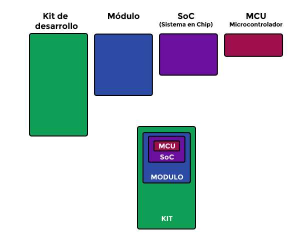

# ESP

Para incorporar al ESP8266 y al ESP32 a idOS utilizaremos el framework para Arduino, documentado en la documentación del [ESP8266 para Arduino](https://arduino-esp8266.readthedocs.io) y del [ESP32 para Arduino](https://github.com/).

## ESP8266
El ESP8266 ...............

El [datasheet](../../../../docs/datasheets/0a-esp8266ex_datasheet_en.pdf)...
### NodeMCU
Al igual que Arduino, el NodeMCU es la palca (kit) de desarrollo para el ESP8266 que se estructura como muestra la figura.

Este incluye, en este caso, el módulo ESP-12 que a su vez incluye el ESP8266 como SoC (*System on Chip*). Existen 3 generaciones (V1, V2 y V3) y la más reciente es la V3 de Lolin, que no es estándar por lo que solo se recogen dos versiones, v0.9 y v1.0, donde Lolin queda en v1.0. 

Recomendamos [este](https://programarfacil.com/podcast/nodemcu-tutorial-paso-a-paso/) post de Programa Fácil que recoge con mucho detalle las características del NodeMCU, pinout, sus generaciones y otros datos de interés.
### ESP8266 WiFi

#### Modos
Los modos son la forma en que operará el ESP con respecto a como se conecta con otros dispositivos WiFi. Se debe ser explísito en la inicilización y se hace con el procedimiento *WiFi.mode(WIFI_MODE)*:
- WIFI_STA: Modo de estación, cuando es solo cliente del WiFi.
- WIFI_AP: Access Point o Punto de Acceso.
- WIFI_AP_STA: Ambos modos, puede ser utilizado para hacer relay o mallas.

