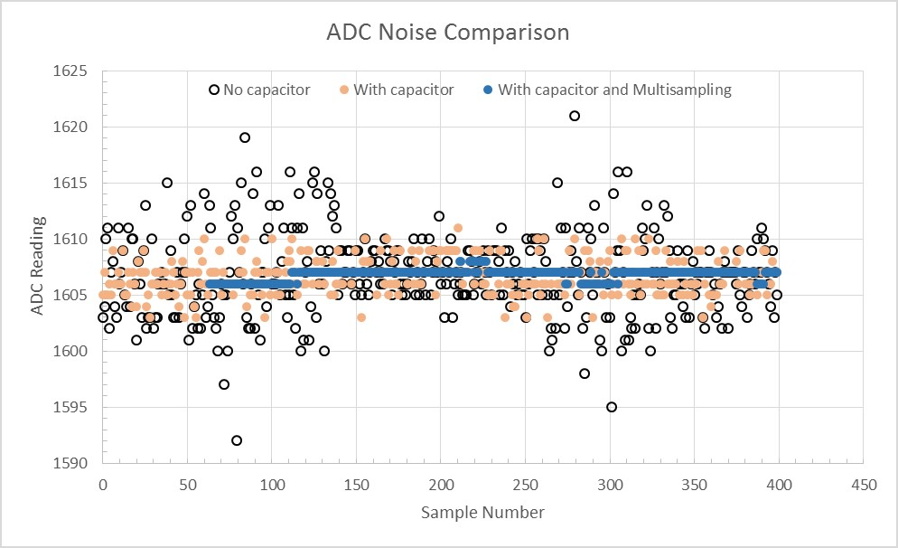

# ESP

Para incorporar al ESP8266 y al ESP32 a idOS utilizaremos el framework para Arduino, documentado en la documentación del [ESP8266 para Arduino](https://arduino-esp8266.readthedocs.io) y del [ESP32 para Arduino](https://github.com/).

## ESP8266

El ESP8266 ...............

El [datasheet](../../../../docs/datasheets/0a-esp8266ex_datasheet_en.pdf)...

### I2C

Los pines de I2C no suelen aparecer rotulados en las placas de los distintos kits por lo que haremos un aparte aquí.

| I2C pin | Pin |
| :-----: | :-: |
|   SCL   | D1 |
|   SDA   | D2 |

> Hay que recordar que el mapa de pines en el ESP8266 no es el mismo que en Arduino, por lo que 1 no es D1, ni 2 es D2.

### NodeMCU

Al igual que Arduino, el NodeMCU es la palca (kit) de desarrollo para el ESP8266 que se estructura como muestra la figura.

Este incluye, en este caso, el módulo ESP-12 que a su vez incluye el ESP8266 como SoC (*System on Chip*). Existen 3 generaciones (V1, V2 y V3) y la más reciente es la V3 de Lolin, que no es estándar por lo que solo se recogen dos versiones, v0.9 y v1.0, donde Lolin queda en v1.0.

Recomendamos [este](https://programarfacil.com/podcast/nodemcu-tutorial-paso-a-paso/) post de Programa Fácil que recoge con mucho detalle las características del NodeMCU, pinout, sus generaciones y otros datos de interés.

### ESP8266 WiFi

#### Modos

Los modos son la forma en que operará el ESP con respecto a como se conecta con otros dispositivos WiFi. Se debe ser explísito en la inicilización y se hace con el procedimiento *WiFi.mode(WIFI_MODE)*:

- WIFI_STA: Modo de estación, cuando es solo cliente del WiFi.
- WIFI_AP: Access Point o Punto de Acceso.
- WIFI_AP_STA: Ambos modos, puede ser utilizado para hacer relay o mallas.

## ESP32 ADC

La documentación oficial soble el ADC de la placa ESP32 la puede encotrar [aquí](https://docs.espressif.com/projects/esp-idf/en/latest/esp32/api-reference/peripherals/adc.htm). No obstante para su eso con el *framework* de Arduino puede verla [aquí]().
El ESP32 tiene 2 periféricos de hardware ADC de 12 bits SAR (Successive Approximation Register) que pueden leer 18 canales de entrada analógica diferentes.El driver del controlador del ADC admite el ADC1 (8 canales, conectados a los GPIOs 32 - 39), y el ADC2 (10 canales, conectados a los GPIOs 0, 2, 4, 12 - 15, y 25 - 27). Sin embargo, el uso de ADC2 tiene algunas restricciones para la aplicación:

- El ADC2 es utilizado por el controlador Wi-Fi. Por lo tanto, la aplicación sólo puede utilizar ADC2 cuando el controlador Wi-Fi no se ha iniciado.
- Algunos de los pines del ADC2 se utilizan como pines de conexión (GPIO 0, 2, 15), por lo que no se pueden utilizar libremente

### Minimizando el ruido

El ADC del ESP32 puede ser sensible al ruido, lo que provoca grandes discrepancias en las lecturas del ADC. Dependiendo del escenario de uso, los usuarios pueden conectar un condensador de derivación (por ejemplo, un condensador cerámico de 100 nF) al pin de entrada del ADC en uso, para minimizar el ruido. Además, también se puede utilizar el muestreo múltiple para mitigar aún más los efectos del ruido.
El gráfico comparativo de la mitigación del ruido a partir del muestreo múltiple y el uso del capacitor se encuentra en la [documentación del ESP32](https://docs.espressif.com/projects/esp-idf/en/latest/esp32/api-reference/peripherals/adc.html#minimizing-noise).

