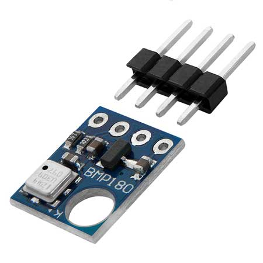

# BMP180
El BMP180 es un termómetro y barométrico digital, que emplea su sensor de temperatura para compensar sus efectos en la medición de la presión barométrica. A su vez, el BMP180 es una versión mejorada del BMP085, siendo ambos modelos compatibles entre si tanto en hardware como software. Puede encontrar su datasheet [aquí](../../../../../../docs/datasheets/bmp180_datasheet_V2.5.pdf). La tensión de alimentación debe estar en el rango de 1,8V a 3,6V. Sin embargo, los módulos suelen venir con un regulador de tensión de la serie XC6206 de 3,3V.

La presión atmosférica es la fuerza que ejerce el aire (atmósfera) sobre la superficie de la tierra. La presión atmosférica se debe al peso de la columna de aire sobre determinada área, es por esta razón que al medir la presión atmosférica en puntos con mayor altitud, el valor de la presión es menor por ser menor la cantidad de aire. La presión atmosférica también varía con el clima, principalmente con la temperatura, pues esta hace cambiar la densidad del aire, que se ve reflejado en un cambio en el peso y por consiguiente en un cambio de presión.

Entonces, la presión atmosférica varía con la temperatura y la altitud, estas dos variables son las más representativas para el cambio de presión. Factores como la humedad relativa y la velocidad del viento también influyen en la presión atmosférica en menor forma y pueden ser obviados.

Lo que mide el sensor BMP180 es la presión absoluta (Barométrica) y la temperatura, al sensar la temperatura podemos compensar su influencia en la presión y asi determinar con mayor exactitud la altitud.

|   Variable    |   mínimo  |	máximo	|   resolución  |
|:-------------:|:---------:|:---------:|:-------------:|
|   Temperatura |   -40ºC   |	+85ºC   |   ± 1ºC       |
|   Presión     |	300 hPa	|  1.100 hPa|	± 1 hPa     |
|   Altitud	    |   0 m	    |  19.130 m |	± 1 m       |

## Biblioteca SparkFun BMP180_Breakout

Para IdOS se ha seeccionado la biblioteca [SparkFun BMP180_Breakout Arduino Library](https://github.com/adafruit/Adafruit-BMP085-Library) en su versión 1.2.1, por ser la más extendida en los diferentes proyectos.

