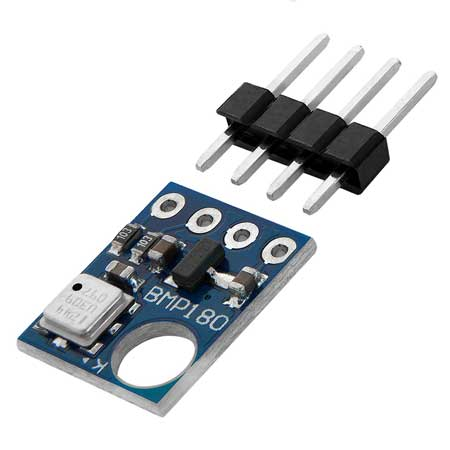

# BMP180
El BMP180 es un termómetro y barométrico digital, que emplea su sensor de temperatura para compensar sus efectos en la medición de la presión barométrica. A su vez, el BMP180 es una versión mejorada del BMP085, siendo ambos modelos compatibles entre si tanto en hardware como software. Puede encontrar su datasheet [aquí](../../../../../../docs/datasheets/bmp180_datasheet_V2.5.pdf). La tensión de alimentación debe estar en el rango de 1,8V a 3,6V. Sin embargo, los módulos suelen venir con un regulador de tensión de la serie XC6206 de 3,3V.

La presión atmosférica es la fuerza que ejerce el aire (atmósfera) sobre la superficie de la tierra. La presión atmosférica se debe al peso de la columna de aire sobre determinada área, es por esta razón que al medir la presión atmosférica en puntos con mayor altitud, el valor de la presión es menor por ser menor la cantidad de aire. La presión atmosférica también varía con el clima, principalmente con la temperatura, pues esta hace cambiar la densidad del aire, que se ve reflejado en un cambio en el peso y por consiguiente en un cambio de presión.

Entonces, la presión atmosférica varía con la temperatura y la altitud, estas dos variables son las más representativas para el cambio de presión. Factores como la humedad relativa y la velocidad del viento también influyen en la presión atmosférica en menor forma y pueden ser obviados.

Lo que mide el sensor BMP180 es la presión absoluta (Barométrica) y la temperatura, al sensar la temperatura podemos compensar su influencia en la presión y asi determinar con mayor exactitud la altitud.

|   Variable    |   mínimo  |	máximo	|   resolución  |
|:-------------:|:---------:|:---------:|:-------------:|
|   Temperatura |   -40ºC   |	+85ºC   |   ± 1ºC       |
|   Presión     |	300 hPa	|  1.100 hPa|	± 1 hPa     |
|   Altitud	    |   0 m	    |  19.130 m |	± 1 m       |

## Biblioteca SparkFun BMP180_Breakout

Para IdOS se ha seeccionado la biblioteca [SparkFun BMP180_Breakout Arduino Library](https://github.com/adafruit/Adafruit-BMP085-Library) en su versión 1.2.1, por ser la más extendida en los diferentes proyectos.

Cuenta con las siguientes funciones para la clase SFE_BMP18:

- *begin()*: Inicializa el sensor BMP180, nos retorna 1 si la inicialización es correcta o 0 si ha fallado.         
- *startTemperature()*: Inicia una medición de temperatura y nos retorna el tiempo en milisegundos que necesitamos esperar antes de obtener la lectura. Si nos retorna un 0, es porque ha fallado el inicio de la medición de temperatura.
- *getTemperature(T)*: Obtener la temperatura en la variable T, antes de usar esta función es necesario llamar a la función startTemperature() y que haya transcurrido el tiempo adecuado para la lectura; retorna 1 o 0 si la lectura se ha realizado con éxito o no respectivamente.
- *startPressure(Sobremuetreo)*: Función para iniciar una medición de presión, hay que indicar la cantidad de muestras adicionales  (de 0 a 3) que el sensor debe tomar para la lectura de la presión y nos retorna el tiempo en milisegundos que necesitamos esperar antes de obtener la lectura. Si nos retorna un 0, es porque ha fallado el inicio de la medición de presión.
- *getPressure(P, T)*: Obtener el valor de la medición iniciado previamente con startPressure(); es necesario darle como parámetro la temperatura T el cual servirá para compensar la influencia de la temperatura en el cálculo de la presión, el valor de la presión absoluta se guarda en la variable P. Retorna 1 o 0 si la lectura se ha realizado con éxito o no respectivamente.
- *altitude(P, Po)* Calcula la altitud entre el punto donde se ha tomado la lectura de presión P (en mbar) con respecto a un punto de referencia con presión Po (en mbar). Nos retorna el valor de la altitud en metros.
- *sealevel(P, A)*: Realiza el cálculo inverso a altitude(P, Po) , Dado una presión P (en mbar) y una altitud A (en metros) calcula la presión al nivel del mar o punto desde donde se mide la altura. Retorna el valor de la presión en mbar

## Ejemplos para idOS
Puede encontrar los ejemplos [aquí](../../../../../../examples/sensors/bmp180/readme.md)
