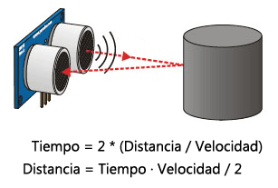

# New Ping para Sensor de Ultrasonido
El código de esta biblioteca está tomado tal cual (as is) de la biblioteca New Ping de Tim Eckel.

- *versión* - v1.9.4 - 01/26/2022
- *web* https://bitbucket.org/teckel12/arduino-new-ping/wiki/Home

Ver el [NewPing.h](NewPing.h) para más información.

## Hardware
Debería fncionar con los sensore de ultrasonido SR04, SRF05, SRF06, DYP-ME007, URM37 & Parallax PING.
### SR04
El rango de medición teórico del sensor HC-SR04 es de 2cm a 400 cm, con una resolución de 0.3cm. En la práctica, sin embargo, el rango de medición real es mucho más limitado, en torno a 20cm a 2 metros.

## Sensores de ultrasonido

El sensor se basa simplemente en medir el tiempo entre el envío y la recepción de un pulso sonoro. 

Sabemos que la velocidad del sonido es 343 m/s en condiciones de temperatura 20 ºC, 50% de humedad, presión atmosférica a nivel del mar. Transformando unidades resulta que el sonido tarda 29,2 microsegundos en recorrer un centímetro. Entoces si medimos el tiempo que tarda el pulso en ir y volver y la dividimos entre dos podemos estimar la distacia al objeto.

Los sensores de ultrasonidos son sensores de baja precisión. La orientación de la superficie a medir puede provocar que la onda se refleje, falseando la medición. Además, no resultan adecuados en entornos con gran número de objetos, dado que el sonido rebota en las superficies generando ecos y falsas mediciones. Tampoco son apropiados para el funcionamiento en el exterior y al aire libre.