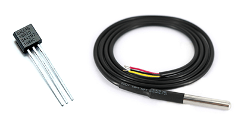
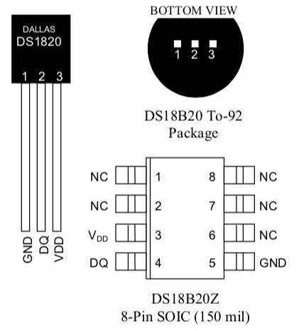

# DS18B20
El DS18B20 es un sensor de temperaturas fabricado por la compañía Maxim Integrated.

>Originalmente el sensor DS18B20 era fabricado por la empresa Dallas Semiconductor, que fue comprada por Maxim Integrated en 2001. Por ese motivo aún encontraréis referirse a este dispositivo como Dallas DS18B20, así como en Sketch y librerías.

Una de las ventajas del DS18B20 es que se comercializa tanto en un integrado TO-92 como en forma de sonda impermeable, lo que permite realizar mediciones de temperatura en líquidos y gases. Puede encontrar su datasheet [aquí](../../../../../docs/datasheets/DS18B20-DallasSemiconductor.pdf)

El DS18B20 emplea un bus de comunicación denominado 1-Wire propietario de la empresa Maxim Integrated. Cada sensor tiene una dirección unica de 64bits establecida de fábrica, esta dirección sirve para identificar al dispositivo con el que se está comunicando, puesto que en un bus 1-wire pueden existir más de un dispositivo.

La principal ventaja este bus es que necesita un único conductor para realizar la comunicación (sin contar el conductor de tierra). Los dispositivos pueden ser alimentados directamente por la línea de datos, o mediante una línea adicional con una tensión de 3.0 a 5.5V. Dentro del mismo bus 1-Wire podemos instalar tantos sensores como deseemos. Además, el bus 1-Wire permite emplear cables más largos que otros sistemas antes de que se deteriore la comunicación. 

Por otra parte la mayor desventaja del sistema 1-Wire es que requiere un código complejo, lo que a su vez supone una alta carga del procesador para consultar el estado de los sensores. El tiempo de adquisición total de una medición puede ser de hasta 750ms

El DS18B20 también dispone de un sistema de alarma que permite grabar en la memoria no volátil del DS18B20 los limites inferiores y superiores. El bus 1-Wire permite consultar si algún dispositivo conectado ha activado una alarma.

Un resumen técnico se puede ver en la siguente tabla. 

|   Característica      |               Valor                       |
|:---------------------:|:-----------------------------------------:|
|   VDD                 |   3V a 5,5V                               |
|   Rango	            | -55ºC a 125ºC                             |
|Error (-10ºC a 85ºC)   |	±0,5ºC                                  |
|Error (-55ºC a 125ºC)  |	±2ºC                                    |
|Resolución programable	| 9-bit, 10-bit, 11-bit o 12-bit (default)  |

## Pinout
El ds18b20 viene en varios sabores, pero todos tienen tres pines útiles, VDD (entre 3 - 5V), GND y DQ (datos).

  

## Modos de conexión

El sensor tiene dos métodos de alimentación, el que se podría decir normal (a través de VDD) el modo parásito, donde se alimenta por el propio pin de datos, donde el sensor internamente obtiene energía del pin de datos cuando este se encuentra en un estado alto y almacena carga en un condensador para cuando la línea de datos esté en una estado bajo.

Notar que el pin GND y VDD están ambos conectados a GND, esto es indispensable para que se active el  Parasite Power . EL MOSFET en la imagen es necesario para cuando se realicen conversiones de temperatura o copiar datos desde la memoria de circuito de la EEPROM, en estas operaciones la corriente de operación aumenta y si solo se suministra energía a través de la resistencia pueden causar caídas de voltaje en el condensador interno.

En cualquiera de los casos el sensor necesita de una resistencia pull-up de 4,7 kΩ, aunque esta varía en dependencia del largo del cable. 

|   pull-up	    |   Largo del cable |
|:-------------:|:-----------------:|
|   4,7 kΩ	    |    0 m a 5 m      |
|   3,3 kΩ	    |    5 m a 10 m     |
|   2,2 kΩ	    |   10 m a 20 m     |
|   1,2 kΩ	    |   20 m a 50 m     |

## Bibliotecas

Para IdOS se ha seleccionado la biblioteca [OneWire](https://github.com/PaulStoffregen/OneWire) en su versión 2.3.6 para manejar el protocolo One Wire y [DallasTemperature]( https://github.com/milesburton/Arduino-Temperature-Control-Library) en su vesión 3.9.0. Estas son cedidas por los fabricantes y utilizadas en los distintos ejemplos consultados. Para más información refiérase a la web de su [desarrolador](http://www.milesburton.com/Dallas_Temperature_Control_Library).